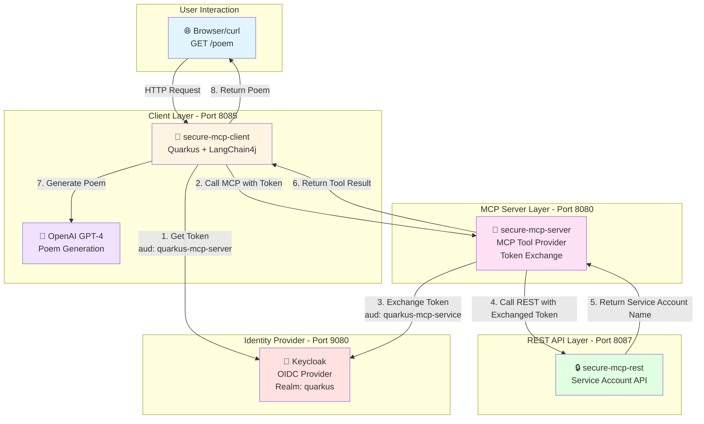
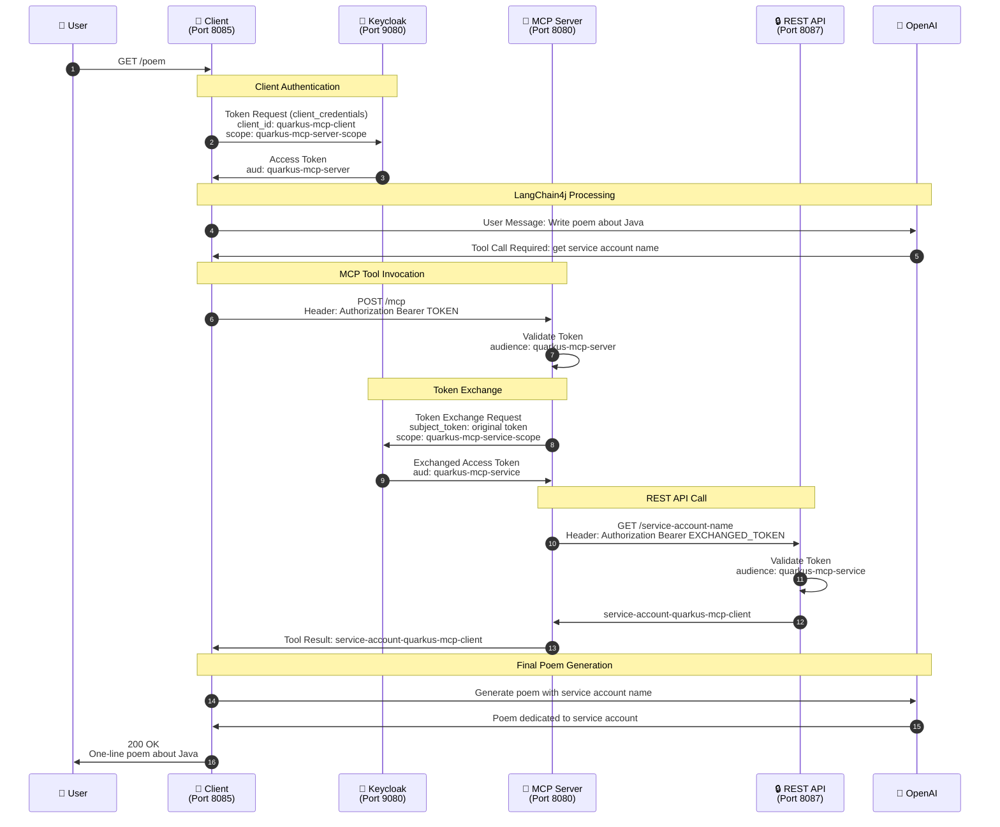
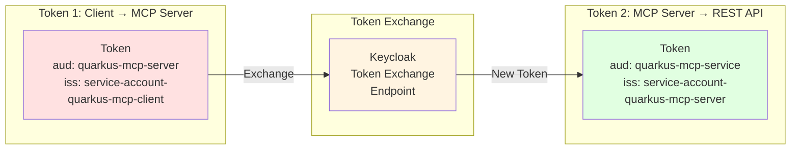

# Secure MCP Demo Architecture

## System Architecture Diagram



## Authentication & Token Flow



## Component Details

### 🌐 Browser/User
- **Purpose**: Initiates the poem generation request
- **Endpoint**: `http://localhost:8085/poem`
- **Method**: GET

### 📱 Secure MCP Client (Port 8085)
- **Technology**: Quarkus + LangChain4j + OpenAI
- **OIDC Client**: `quarkus-mcp-client`
- **Capabilities**:
  - Acquires tokens using OAuth2 `client_credentials` grant
  - Communicates with MCP server
  - Orchestrates AI poem generation with OpenAI

### 🔧 Secure MCP Server (Port 8080)
- **Technology**: Quarkus + MCP Server Extension
- **OIDC Client**: `quarkus-mcp-server`
- **Capabilities**:
  - Provides MCP tool: `service-account-name-provider`
  - Validates incoming tokens (audience: `quarkus-mcp-server`)
  - Performs OAuth2 token exchange
  - Calls protected REST API with exchanged token

### 🔒 Secure MCP REST (Port 8087)
- **Technology**: Quarkus REST + OIDC
- **OIDC Tenant**: `service-account-name-rest-server`
- **Capabilities**:
  - Protected REST endpoint: `/service-account-name`
  - Validates tokens with audience: `quarkus-mcp-service`
  - Returns authenticated service account principal name

### 🔐 Keycloak (Port 9080)
- **Realm**: `quarkus`
- **Clients**:
  - `quarkus-mcp-client` (service account enabled)
  - `quarkus-mcp-server` (service account + token exchange enabled)
  - `quarkus-mcp-service` (audience target)
- **Client Scopes**:
  - `quarkus-mcp-server-scope` → adds `quarkus-mcp-server` audience
  - `quarkus-mcp-service-scope` → adds `quarkus-mcp-service` audience

### 🤖 OpenAI
- **Model**: GPT-4o-mini
- **Purpose**: Generates creative poem using service account information
- **Authentication**: API Key via `OPENAI_API_KEY` environment variable

## Security Model

### Token Audience Enforcement



### Why Token Exchange?

1. **Audience Isolation**: Each service validates only tokens intended for it
2. **Principle of Least Privilege**: Tokens are scoped to specific audiences
3. **Security**: Prevents token reuse across different services
4. **Zero Trust**: Each service independently validates tokens

## Data Flow Example

### Request Flow
```
User Request: GET /poem
    ↓
Client acquires token (aud: quarkus-mcp-server)
    ↓
Client asks OpenAI to write a poem
    ↓
OpenAI determines it needs service account name
    ↓
Client calls MCP tool with token
    ↓
MCP validates token (aud: quarkus-mcp-server) ✓
    ↓
MCP exchanges token (aud: quarkus-mcp-service)
    ↓
MCP calls REST API with exchanged token
    ↓
REST validates token (aud: quarkus-mcp-service) ✓
    ↓
REST returns: "service-account-quarkus-mcp-client"
    ↓
MCP returns tool result to Client
    ↓
OpenAI generates poem with service account name
    ↓
Client returns poem to User
```

### Response Example
```
To service-account-quarkus-mcp-client,
Java brews strong logic like morning coffee,
powering dreams into compiled reality.
```

## Port Summary

| Service | Port | Purpose |
|---------|------|---------|
| Keycloak | 9080 | OIDC Provider & Token Exchange |
| MCP Server | 8080 | MCP Tool Provider |
| MCP Client | 8085 | LangChain4j Client |
| REST API | 8087 | Service Account Information |

## Environment Variables

| Variable | Used By | Purpose |
|----------|---------|---------|
| `QUARKUS_MCP_CLIENT_SECRET` | secure-mcp-client | Authenticate client to Keycloak |
| `QUARKUS_MCP_SERVER_SECRET` | secure-mcp-server | Authenticate server for token exchange |
| `OPENAI_API_KEY` | secure-mcp-client | Authenticate with OpenAI API |

## Key Technologies

- **Quarkus**: Java framework for cloud-native applications
- **LangChain4j**: Java library for building LLM applications
- **MCP (Model Context Protocol)**: Protocol for AI tool integration
- **OIDC (OpenID Connect)**: Authentication protocol
- **OAuth2 Token Exchange**: RFC 8693 token exchange mechanism
- **Keycloak**: Open-source identity and access management
- **OpenAI**: AI language model provider

## Security Features

- ✅ **Zero hardcoded credentials** - All secrets via environment variables
- ✅ **Token audience validation** - Each service validates correct audience
- ✅ **Token exchange** - Prevents token reuse across services
- ✅ **Service account authentication** - No user interaction required
- ✅ **OIDC standard compliance** - Industry-standard authentication
- ✅ **Mutual TLS ready** - Can be enhanced with mTLS
- ✅ **Proper logging** - JBoss logging instead of System.out
