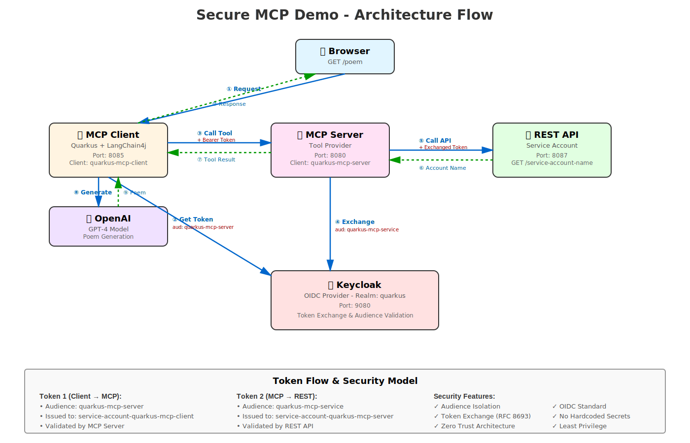

# Secure MCP Demo with Quarkus

This demo showcases a secure Model Context Protocol (MCP) implementation using Quarkus, LangChain4j, Keycloak, and OpenAI. The application demonstrates OIDC-based security with token exchange between services.

## Architecture



📖 **[View Detailed Architecture Documentation](ARCHITECTURE.md)** - Includes Mermaid diagrams, sequence flows, and security model details

The project consists of three modules:

1. **secure-mcp-server** (Port 8080): MCP server that provides a tool to retrieve service account information
2. **secure-mcp-rest** (Port 8087): Protected REST API that returns service account names
3. **secure-mcp-client** (Port 8085): LangChain4j client that uses the MCP server to write poems

### Security Flow

1. Client authenticates with Keycloak using `client_credentials` grant
2. Client receives token with `quarkus-mcp-server` audience
3. MCP server validates the incoming token
4. MCP server exchanges token for one with `quarkus-mcp-service` audience
5. MCP server calls REST API with exchanged token
6. REST API validates token and returns service account name
7. LangChain4j uses this information to generate a poem

## Prerequisites

- Java 17 or 21
- Maven 3.8+
- Podman Desktop (or Docker Desktop)
- OpenAI API Key

## Step 1: Run Keycloak on Podman Desktop

### Start Keycloak Container

```bash
podman run -d \
  --name keycloak-mcp \
  -p 9080:8080 \
  -e KEYCLOAK_ADMIN=admin \
  -e KEYCLOAK_ADMIN_PASSWORD=admin \
  quay.io/keycloak/keycloak:latest \
  start-dev
```

Wait for Keycloak to start (usually 30-60 seconds). Access the admin console at:
- URL: http://localhost:9080
- Username: `admin`
- Password: `admin`

## Step 2: Configure Keycloak

### 2.1 Create Realm

1. Click on the dropdown in the top-left (shows "Keycloak" or "Master")
2. Click **Create Realm**
3. Realm name: `quarkus`
4. Click **Create**

### 2.2 Create Client: quarkus-mcp-client

1. Go to **Clients** → **Create client**
2. **General Settings:**
   - Client type: `OpenID Connect`
   - Client ID: `quarkus-mcp-client`
   - Click **Next**
3. **Capability config:**
   - Enable **Client authentication**: `ON`
   - Enable **Service accounts roles**: `ON`
   - Click **Next**
4. **Login settings:**
   - Leave defaults, click **Save**
5. Go to **Credentials** tab
   - Copy the **Client secret** (you'll need this later)
   - Example: `44qvOBz56dJ1liaVDfAlwGOuT7IHojpz`

### 2.3 Create Client: quarkus-mcp-server

1. Go to **Clients** → **Create client**
2. **General Settings:**
   - Client type: `OpenID Connect`
   - Client ID: `quarkus-mcp-server`
   - Click **Next**
3. **Capability config:**
   - Enable **Client authentication**: `ON`
   - Enable **Service accounts roles**: `ON`
   - Click **Next**
4. **Login settings:**
   - Click **Save**
5. Go to **Credentials** tab
   - Copy the **Client secret**
   - Example: `IWS1GxdYGTwlwyHIcqW2OndE9fuIrShD`
6. Go to **Advanced** tab
   - Find **OAuth 2.0 Token Exchange**
   - Enable **OAuth 2.0 Token Exchange Enabled**: `ON`
   - Click **Save**

### 2.4 Create Client: quarkus-mcp-service

1. Go to **Clients** → **Create client**
2. **General Settings:**
   - Client type: `OpenID Connect`
   - Client ID: `quarkus-mcp-service`
   - Click **Next**
3. **Capability config:**
   - Enable **Client authentication**: `ON`
   - Click **Next**
4. **Login settings:**
   - Click **Save**

### 2.5 Create Client Scope: quarkus-mcp-server-scope

1. Go to **Client scopes** → **Create client scope**
2. **Settings:**
   - Name: `quarkus-mcp-server-scope`
   - Type: `Optional`
   - Click **Save**
3. Go to **Mappers** tab → **Add mapper** → **By configuration**
4. Select **Audience**
5. Configure:
   - Name: `quarkus-mcp-server-audience`
   - Included Client Audience: `quarkus-mcp-server`
   - Add to access token: `ON`
   - Click **Save**

### 2.6 Create Client Scope: quarkus-mcp-service-scope

1. Go to **Client scopes** → **Create client scope**
2. **Settings:**
   - Name: `quarkus-mcp-service-scope`
   - Type: `Optional`
   - Click **Save**
3. Go to **Mappers** tab → **Add mapper** → **By configuration**
4. Select **Audience**
5. Configure:
   - Name: `quarkus-mcp-service-audience`
   - Included Client Audience: `quarkus-mcp-service`
   - Add to access token: `ON`
   - Click **Save**

### 2.7 Assign Scopes to Clients

#### Assign quarkus-mcp-server-scope to quarkus-mcp-client

1. Go to **Clients** → **quarkus-mcp-client**
2. Go to **Client scopes** tab
3. Click **Add client scope**
4. Select `quarkus-mcp-server-scope`
5. Select **Optional** as assignment type
6. Click **Add**

#### Assign quarkus-mcp-service-scope to quarkus-mcp-server

1. Go to **Clients** → **quarkus-mcp-server**
2. Go to **Client scopes** tab
3. Click **Add client scope**
4. Select `quarkus-mcp-service-scope`
5. Select **Optional** as assignment type
6. Click **Add**

## Step 3: Set Environment Variables

You need to set three environment variables with the secrets you copied from Keycloak:

### Option 1: Export in Current Shell (Temporary)

```bash
# Client secret from quarkus-mcp-client (Step 2.2)
export QUARKUS_MCP_CLIENT_SECRET=YOUR_CLIENT_SECRET_FROM_STEP_2_2

# Client secret from quarkus-mcp-server (Step 2.3)
export QUARKUS_MCP_SERVER_SECRET=YOUR_CLIENT_SECRET_FROM_STEP_2_3

# Your OpenAI API key
export OPENAI_API_KEY=sk-your-actual-openai-api-key-here
```

### Option 2: Add to Shell Profile (Persistent)

Add to `~/.zshrc` (for zsh) or `~/.bashrc` (for bash):

```bash
echo 'export QUARKUS_MCP_CLIENT_SECRET=YOUR_CLIENT_SECRET_FROM_STEP_2_2' >> ~/.zshrc
echo 'export QUARKUS_MCP_SERVER_SECRET=YOUR_CLIENT_SECRET_FROM_STEP_2_3' >> ~/.zshrc
echo 'export OPENAI_API_KEY=sk-your-actual-openai-api-key-here' >> ~/.zshrc
source ~/.zshrc
```

### Option 3: Create a .env File (Recommended for Development)

Copy the example file and edit with your values:

```bash
cp .env.example .env
```

Then edit `.env` and replace the placeholder values with your actual secrets:

```bash
# Keycloak Client Secrets
export QUARKUS_MCP_CLIENT_SECRET=YOUR_CLIENT_SECRET_FROM_STEP_2_2
export QUARKUS_MCP_SERVER_SECRET=YOUR_CLIENT_SECRET_FROM_STEP_2_3

# OpenAI API Key
export OPENAI_API_KEY=sk-your-actual-openai-api-key-here
```

Then source it before running:

```bash
source .env
```

**Important:** Never commit the `.env` file to version control. It's already in `.gitignore`.

## Step 4: Build and Run the Applications

**Important:** Make sure you've set the environment variables from Step 3 before running!

### Terminal 1: Start secure-mcp-rest (REST Server)

```bash
cd secure-mcp-rest
mvn quarkus:dev
```

Wait for the message: `Listening on: http://localhost:8087`

### Terminal 2: Start secure-mcp-server (MCP Server)

```bash
cd secure-mcp-server
mvn quarkus:dev
```

Wait for the message: `Listening on: http://localhost:8080`

### Terminal 3: Start secure-mcp-client (Client)

```bash
cd secure-mcp-client
mvn quarkus:dev
```

Wait for the message: `Listening on: http://localhost:8085`

## Step 5: Test the Application

### Using curl

```bash
curl http://localhost:8085/poem
```

### Using a browser

Navigate to: http://localhost:8085/poem

### Expected Output

You should see a one-line poem about Java, dedicated to the service account (e.g., `service-account-quarkus-mcp-client`).

Example:
```
To service-account-quarkus-mcp-client, Java brews strong logic like morning coffee, powering dreams into compiled reality.
```

## Verification

### Check the Logs

**MCP Server logs** should show:
```
==================provideServiceAccountName==================
Auth Server URL: http://localhost:9080/realms/quarkus
Auth Cred Secret: [YOUR_SECRET]
Auth Client ID: quarkus-mcp-server
Service Account Name Rest Server Auth Server URL: http://localhost:9080/realms/quarkus
================provideServiceAccountName END====================
```

**REST Server logs** should show:
```
ServiceAccountNameRestServer.getServiceAccountName() called by service-account-quarkus-mcp-server
```

### Verify Token Exchange

The flow demonstrates:
1. Client gets token with `quarkus-mcp-server` audience
2. MCP server exchanges it for token with `quarkus-mcp-service` audience
3. REST server validates the exchanged token

## Troubleshooting

### Keycloak Not Accessible

```bash
# Check if container is running
podman ps

# View Keycloak logs
podman logs keycloak-mcp

# Restart Keycloak
podman restart keycloak-mcp
```

### Authentication Errors

- Verify environment variables are set correctly:
  ```bash
  echo $QUARKUS_MCP_CLIENT_SECRET
  echo $QUARKUS_MCP_SERVER_SECRET
  ```
- Verify client secrets match the values in Keycloak
- Check that all client scopes are properly assigned
- Ensure Token Exchange is enabled on `quarkus-mcp-server`

### OpenAI Errors

```bash
# Verify API key is set
echo $OPENAI_API_KEY

# Check for rate limits or billing issues in OpenAI dashboard
```

### Port Conflicts

If ports 8080, 8085, 8087, or 9080 are in use:
- Stop conflicting services
- Or modify ports in `application.properties` and update configurations accordingly

## Cleanup

### Stop Applications

Press `Ctrl+C` in each terminal running `mvn quarkus:dev`

### Stop and Remove Keycloak

```bash
podman stop keycloak-mcp
podman rm keycloak-mcp
```

## Architecture Diagram

```
┌─────────────┐
│   Browser   │
└──────┬──────┘
       │ GET /poem
       ▼
┌─────────────────────┐
│  secure-mcp-client  │ (Port 8085)
│  + LangChain4j      │
│  + OpenAI           │
└──────┬──────────────┘
       │ Authenticated Request
       │ Token: aud=quarkus-mcp-server
       ▼
┌─────────────────────┐
│  secure-mcp-server  │ (Port 8080)
│  + MCP Server       │
│  + Token Exchange   │
└──────┬──────────────┘
       │ Exchange Token
       │ Token: aud=quarkus-mcp-service
       ▼
┌─────────────────────┐
│  secure-mcp-rest    │ (Port 8087)
│  + REST API         │
└─────────────────────┘
       ▲
       │
   ┌───┴────┐
   │Keycloak│ (Port 9080)
   │ OIDC   │
   └────────┘
```

## References

- [Securing MCP Server with OIDC Client](https://quarkus.io/blog/secure-mcp-oidc-client/)
- [Code based on quarkus-langchain4j samples](https://github.com/quarkiverse/quarkus-langchain4j/tree/main/samples/secure-mcp-cmd-client-server)
- [Quarkus OIDC Documentation](https://quarkus.io/guides/security-oidc-bearer-token-authentication)
- [Quarkus MCP Extension](https://docs.quarkiverse.io/quarkus-mcp/dev/index.html)
- [LangChain4j Quarkus](https://docs.quarkiverse.io/quarkus-langchain4j/dev/index.html)

## DISCLAIMER

This README, the ARCHITECTURE.md documentation, and the architecture-diagram.svg were generated with [Claude Code](https://claude.ai/code).

